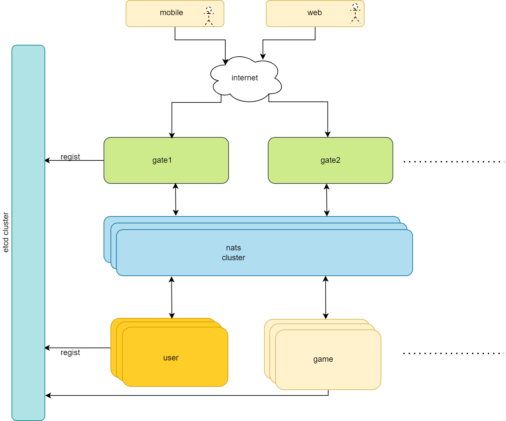

#### 介绍

newtbig是一个基于 Golang 实现的服务器开发框架，旨在帮助开发者快速构建高可用、高并发、低耦合、负载均衡、动态伸缩，支持百万在线的服务器。使开发者能够专注于业务逻辑的实现，而无需关心底层的技术细节，轻松实现百万用户在线的服务器。

#### 宗旨

简单，粗暴，好用

#### 特性

1. 高可用性

    内置了服务发现、容错处理、负载均衡等机制，确保服务的稳定性和可用性。

2. 高并发性

    基于golang高并发特性，对网络通信，协程，通道，内存池等合理使用，实现高并发。

3. 低耦合性

    采用微服务架构，基于nats实现服务间rpc，将系统拆分为多个独立的服务，降低服务之间的耦合度。

4. 负载均衡

    采用一致性hash负载均衡策略，根据服务状态动态调整流量分配，实现服务的横向扩展。

5. 动态伸缩

    框架支持自动伸缩机制，根据服务负载和性能指标动态调整服务实例的数量。

6. 扩展性

    框架支持tcp，websocket等多种网络协议，可自定义网络封包，根据实际需求进行扩展。

#### 架构

